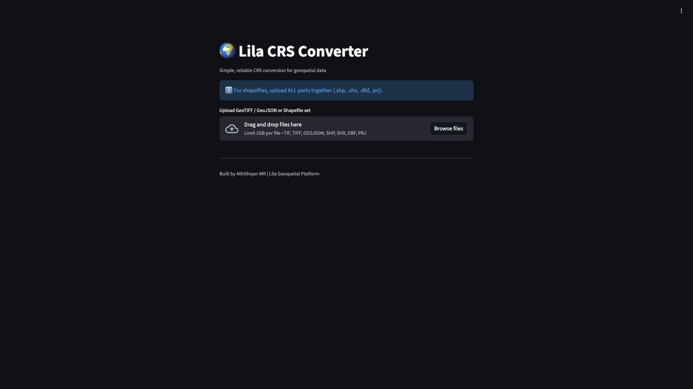

🌍 Lila CRS Converter

Lila CRS Converter is a containerized geospatial web platform for detecting and converting Coordinate Reference Systems (CRS) of raster and vector datasets.

It is built for GIS analysts, remote sensing engineers, and geospatial developers who need a fast, reliable way to inspect and reproject spatial data directly in the browser—without relying on heavy desktop GIS software.

## 📸 Preview

  

⸻

✨ What you can do

With Lila CRS Converter, you can:
	•	Upload raster or vector geospatial datasets
	•	Automatically detect the source CRS
	•	Select a target EPSG coordinate system
	•	Reproject the dataset with high accuracy
	•	Download the converted output in professional GIS formats

Supported formats
	•	🛰️ GeoTIFF (raster)
	•	🗺️ Shapefile (multi-file upload, ZIP export)
	•	🧩 GeoJSON, GeoPackage (GPKG)

⸻

🚀 Key Features
	•	✅ Raster reprojection (GeoTIFF)
	•	✅ Vector reprojection (Shapefile ZIP, GeoJSON, GeoPackage)
	•	✅ Multi-file Shapefile upload support
	•	✅ Automatic CRS detection
	•	✅ High-performance FastAPI backend
	•	✅ Interactive Streamlit web interface
	•	✅ Fully Dockerized, cloud-ready architecture
	•	✅ Designed as a foundation for future GeoAI, NDVI, and spatial analytics tools

⸻

🏗️ Project Structure

	lila-crs-converter/
	│
	├── backend/
	│   ├── main.py          # FastAPI application
	│   ├── crs.py           # CRS detection & reprojection engine
	│   ├── utils.py         # File handling & validation
	│   └── config.py        # Application configuration
	│
	├── frontend/
	│   └── app.py           # Streamlit web interface
	│
	├── docker-compose.yml  # Multi-container setup
	├── Dockerfile          # Frontend container
	└── README.md

⚙️ How it works
		1.	The Streamlit frontend manages file uploads and user interaction 
		2.	The FastAPI backend handles CRS detection and reprojection
		3.	Raster data is returned as a reprojected GeoTIFF
		4.	Vector data is exported as GeoJSON, GeoPackage, or Shapefile (ZIP)
		5.	All services run in isolated Docker containers for reproducibility and scalability

🐳 Run locally (Docker)

    git clone https://github.com/Athithiyanmr/geo-crs-converter.git
    cd geo-crs-converter
    docker compose up --build

Open in your browser:

	👉 http://localhost:8501
☁️ Deployment

Lila CRS Converter is designed for cloud deployment using Docker.

🚧 Hetzner Cloud deployment is in progress.
A public demo link will be added here soon.

Once deployed, users will be able to access the platform directly through the browser without any local setup.

⸻

👤 Author

Athithiyan MR
Data Analyst | Geospatial & Remote Sensing Specialist
GeoAI • Climate Analytics • Spatial Systems
	
🔗 LinkedIn: https://www.linkedin.com/in/athithiyan-m-r-/
💻 GitHub: https://github.com/Athithiyanmr

⸻

📜 License

MIT License © 2026 Athithiyan MR
